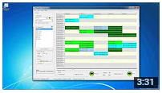

# uni-student-lecture-timetable-scheduler
Application that generates all possible combinations given a set of modules and groups

### Overview
Application that generates all possible rosters based on the modules a student is enrolled in. Every module can have multiple groups with differt lecture timeslots each day.

### Video

### Features
- Select modules and preferences
- Enter/Edit modules, groups, and lecture times manually
- Browse through the modules to have a look at each group's timeslots
- Lock combinations
- Generate all the possible timetables based on the selected modules
- Print and/or save to excel
- Update source files online

### Technologies
- Delphi
- Advanced string handling to convert the source's storage (html) to a workable format (csv)

### Resources
- [Dist](dist.zip)
- Planning
 - [Phase 1 Proposal](phase-1-proposal.pdf)
 - [Phase 2 Pilot Study](phase-2-pilot-study.pdf)
 - [Phase 3 Design](phase-3-design.pdf)

